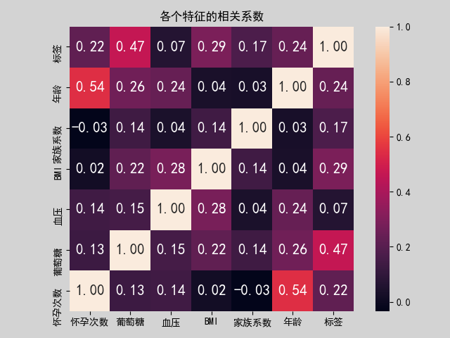
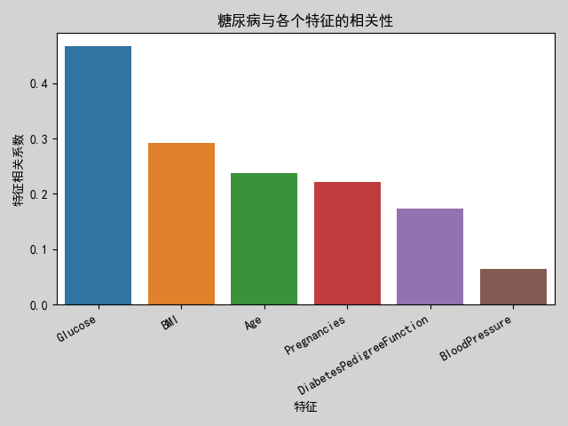
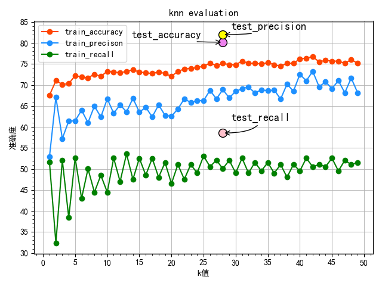
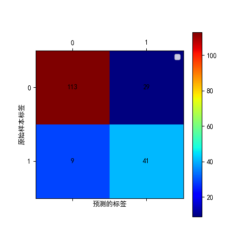

# 皮马印第安人糖尿病预测
pima_diabetes_analysis_and_prediction

<pre>
文件夹:
data  --> 存储原始样本 和 数据清洗后的样本
data_analysis_after_clean  -->  存储糖尿病,BMI,年龄,糖尿病等特征的关系的分析
machineLearning  -->  使用各种机器学习的算法进行训练预测(如:决策树,SVM,逻辑回归分类,k邻近算法等)
model_save  --> 训练好的模型保存的地方, 和预测结果的分析
preprocess  --> 数据预处理: 质量分析(异常值,缺失值),数据特征分析(分布分析,相关性分析),
                离群点分析,数据清洗,数据清洗后的数据可视化展示
</pre>

## 一.development
<pre>
Python 3.6.8
numpy (1.17.2)
pandas (0.25.1)
scikit-learn (0.21.3)
matplotlib (3.1.1)
seaborn (0.9.0)
pickleshare (0.7.5)
</pre>

##  二.数据来源
该数据集源至美国国家糖尿病、消化及肾脏疾病研究所。 数据集的目的是根据已有诊断信息来预测患者是否患有糖尿病。 
但该数据库存在一定局限性，特别是数据集中的患者都是年龄大于等于21岁的皮马印第安女性。

<pre>
糖尿病人士分布
非糖尿病人: 500人
糖尿病人: 268人
</pre>

## 属性
 pima印度糖尿病数据集共有9个属性。记录中的所有人都是女性，她们的怀孕次数已被记录为数据集的第一个属性。
 第二个是口服葡萄糖耐量试验中2小时的血糖浓度值，然后是舒张压（mm hg），第四个是三头肌皮褶厚度（mm），
 然后是2小时的血清胰岛素（mu u/ml）。第六个是体重指数（体重kg/（身高m）^2），第七个是糖尿病家系功能，
 第二个是年龄（岁）。第九列是类变量（0或1）的列，0表示无糖尿病，1表示存在。

<pre>
对比糖尿病和非糖尿病人士的各个特征的平均值
      Pregnancies     Glucose  BloodPressure        BMI  DiabetesPedigreeFunction        Age     Outcome
非糖尿病     3.298000  110.643863      71.114000  30.960000                  0.429734  31.190000      0.0
糖尿病      4.865672  142.319549      75.988806  35.409701                  0.550500  37.067164      1.0

对比糖尿病和非糖尿病人士, 他们明显的差别是,葡萄糖的差值比较高,患糖尿病的人比不患糖尿病的人高出32的值,
其次是年龄和BMI 相对来说,年轻的人比较少患糖尿病, 身体肥胖的人比较容易得糖尿病
再其次是血压,怀孕次数等
 </pre>
 
### 1.bmi
 我们决定取bmi的平均值，发现患此病的人的平均bmi值为34，这意味着他们并不健康和肥胖。
 值得注意的是，那些没有患上这种疾病的人的平均bmi值是30，这是人们变得肥胖的阈值。
 
### 2.葡萄糖
 第二个参数葡萄糖（血糖浓度）
 患此病的人的平均葡萄糖值为141.25,那些没有患此病的人的平均葡萄糖值为110.64,
 这表明糖尿病前期的高血糖状态与胰岛素抵抗和心血管疾病风险增加有关。
 
### 3.血压
  患此病的人的平均血压值为75,那些没有患此病的人的平均血压值为71,可见血压高一定程度上会导致糖尿病的发生

### 4.删除属性SkinThickness and Insulin

SkinThickness and Insulin 的异常值分别有227个和374个, 已经超过样本的20%
<pre>
属性 - 0值数量 - 0值数量和样本的占比
Pregnancies - 111 - 14.453%
Glucose - 5 - 0.651%
BloodPressure - 35 - 4.557%
SkinThickness - 227 - 29.557%
Insulin - 374 - 48.698%
BMI - 11 - 1.432%
DiabetesPedigreeFunction - 0 - 0.0%
Age - 0 - 0.0%
Outcome - 500 - 65.104%
</pre>

### 5.糖尿病的与各个特征属性的关系
由此可见,最影响糖尿病的三大因素分别是:葡萄糖,BMI,年龄

1.葡萄糖,BMI,年龄 这三个特征都高的人, 得糖尿病的概率非常高
2.葡萄糖和BMI都很高,但不得糖尿病的人, 大多都是年轻人20多岁
3.葡萄糖值高,但不患糖尿病人, 跟身体瘦和血压低有很大的关系

## 三.使用机器学习的算法(scikit-learn)模型进行预测

<pre>
逻辑回归,线性判别分析,决策树,高斯贝叶斯分类器,支持向量机SVM分类器,k邻近算法

使用k邻近算法,准确率最高,预测准确率为80%
使用随机森林,预测的准确率为79%
使用逻辑分类算法,预测的准确率为78%
使用SVM支持向量机分类器,预测的准确率为77%

使用k邻近算法,
选择k值是28的时候,准确率(accuracy)达80.2%, 召回率(recall)达58.57%, 准确率(precision)达82%, F1分数达68%

使用随机森林算法,
准确率(accuracy)达79.16%, 召回率(recall)达65.71%, 准确率(precision)达74.19%, F1分数达69.6%

--------k邻近算法预测准确率展示-----如下图----------
使用训练集的数据进行训练(576个样本),图中可见k值是28的时候,accuracy,recall,precision是相对稳定较高,
所以选择k=28的模型对测试集数据进行预测,得出结果 accuracy=80.2%,recall=58.57%,precision=82%
</pre>

<pre>
--------使用测试集样本进行预测--共有192个样本-----预测准确度图示----------
0:非糖尿病人142个样本中,预测113个是非糖尿病的人(预测正确),29个是糖尿病人(预测错误)
1:糖尿病人50个样本中,预测41个是糖尿病人(预测正确),9个是非糖尿病人(预测错误)
</pre>

## 四.模型预测结果分析
<pre>
1. 加载训练结果最优的模型, 使用k邻近算法, 进行预测
2. 使用分类报告, 分析预测结果
3. 使用置信概率, 分析预测结果
4. 查找当中预测错误的所有样本, 对比置信概率,结合其他特征, 综合分析

example:
# 查看预测错误的样本, 预测的结果, 0表示非糖尿病, 1是糖尿病,
# Outcome:实际结果, Predict:预测结果, Prob_0:置信概率为0类别的百分比, Prob_1:置信概率为1类别的百分比

     Pregnance  Glucose  BlPressure   BMI  DiabetesFunc  Age  Outcome  Predict  Prob_0  Prob_1
701          6    125.0          78  27.6         0.565   49        1        0    0.50    0.50
242          3    139.0          54  25.6         0.402   22        1        0    0.71    0.29
744         13    153.0          88  40.6         1.174   39        0        1    0.29    0.71
549          4    189.0         110  28.5         0.680   37        0        1    0.11    0.89
608          0    152.0          82  41.5         0.270   27        0        1    0.36    0.64

</pre>